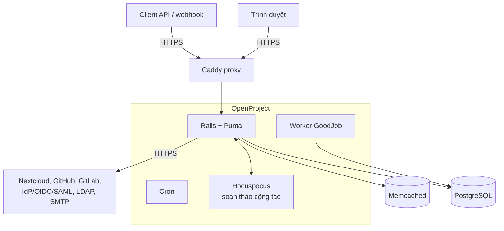

# WIKI – Tài liệu kỹ thuật cho đội phát triển

Tài liệu này giúp thành viên mới (và cả người cũ) nắm nhanh **kiến trúc tổng thể, quy ước viết code, an toàn (safety) và các design pattern** đang dùng trong dự án. Nội dung được tổng hợp từ code thực tế và các file hướng dẫn trong repo; khi có mâu thuẫn, **code và `AGENTS.md` là nguồn đúng**.

> Tài liệu liên quan: [README.md](README.md) · [AGENTS.md](AGENTS.md) · [app/AGENTS.md](app/AGENTS.md) · [spec/AGENTS.md](spec/AGENTS.md) · [docs/development/](docs/development/) · [CONTRIBUTING.md](CONTRIBUTING.md)

## Mục lục

1. [Tổng quan](#1-tổng-quan)
2. [Kiến trúc tổng thể](#2-kiến-trúc-tổng-thể)
3. [Cấu trúc thư mục](#3-cấu-trúc-thư-mục)
4. [Backend: pattern và quy ước](#4-backend-pattern-và-quy-ước)
5. [Hệ thống module (plugin)](#5-hệ-thống-module-plugin)
6. [Frontend](#6-frontend)
7. [Coding convention](#7-coding-convention)
8. [Safety: an toàn và bảo mật](#8-safety-an-toàn-và-bảo-mật)
9. [Kiểm thử](#9-kiểm-thử)
10. [Git workflow và code review](#10-git-workflow-và-code-review)
11. [Môi trường chạy (Docker)](#11-môi-trường-chạy-docker)
12. [Checklist trước khi tạo PR](#12-checklist-trước-khi-tạo-pr)

---

## 1. Tổng quan

| Hạng mục | Công nghệ |
|---|---|
| Backend | Ruby 4.0.7 (`.ruby-version`), Rails ~8.1 |
| Cơ sở dữ liệu | PostgreSQL (bắt buộc) |
| Cache | Memcached |
| Job nền | GoodJob (chạy trong tiến trình `worker`/`cron`) |
| Frontend | Node 24.x, TypeScript; Hotwire (Turbo + Stimulus), Angular (đang di chuyển dần), một phần React |
| UI | Primer Design System qua ViewComponent (`openproject-primer_view_components`) |
| Soạn thảo cộng tác | Hocuspocus (`extensions/op-blocknote-hocuspocus/`) |
| Proxy | Caddy |

Đây là **monorepo lớn** (backend, frontend, nhiều module, hạ tầng Docker). Phiên bản chính xác luôn lấy từ `.ruby-version`, `package.json` (`engines`) và `Gemfile.lock`, không ghi cứng ở nơi khác.

## 2. Kiến trúc tổng thể



Ứng dụng là **hybrid**:

- **Server-rendered** bằng ERB và ViewComponent, tăng tương tác bằng Turbo/Stimulus. Đây là hướng mặc định cho tính năng mới.
- **SPA Angular** cho các màn hình phức tạp (bảng work package, Gantt, boards, team planner…). Các thành phần Angular cũ đang được chuyển dần sang custom element.
- **API v3** (HAL+JSON) dùng chung cho Angular và client bên ngoài.

Luồng xử lý một yêu cầu ghi điển hình:

```
Request → Controller / API endpoint
        → Service (nghiệp vụ, trả ServiceResult)
        → Contract (validate + kiểm tra quyền)
        → Model (ActiveRecord) → PostgreSQL
        → Journal / Notification / Job nền (nếu có)
        → Representer (API) hoặc Component (HTML) để trả kết quả
```

## 3. Cấu trúc thư mục

| Thư mục | Vai trò |
|---|---|
| `app/models` | ActiveRecord model, giữ gọn, tập trung dữ liệu và quan hệ |
| `app/services` | Service object chứa nghiệp vụ, trả về `ServiceResult` |
| `app/contracts` | Contract: validate dữ liệu và kiểm tra quyền (đứng giữa controller và model) |
| `app/controllers` | Controller mỏng |
| `app/components` | ViewComponent (Ruby + ERB + SASS) cho UI server-rendered |
| `app/policies`, `app/forms`, `app/menus`, `app/workers`, `app/seeders` | Policy, form, menu, job, dữ liệu khởi tạo |
| `lib/api/v3` | API v3: endpoint, representer, parse params |
| `lib/open_project` | Hạ tầng lõi: access control (phân quyền), plugin, hook |
| `modules/*` | Các module mở rộng (xem mục 5) |
| `frontend/src/app` | Angular: `core/`, `features/`, `shared/` |
| `frontend/src/stimulus`, `frontend/src/turbo` | Stimulus controller, tích hợp Turbo |
| `frontend/src/global_styles` | SASS toàn cục |
| `config/locales` | Chuỗi dịch |
| `spec/` | RSpec |
| `lookbook/` | Preview ViewComponent |
| `docker/prod`, `docker/ci` | Dockerfile production/local/staging và CI |

## 4. Backend: pattern và quy ước

### 4.1 Service object + `ServiceResult`

Nghiệp vụ phức tạp đặt trong `app/services/`, kế thừa các lớp trong `app/services/base_services/` (ví dụ `BaseServices::BaseCallable`). Service luôn trả về `ServiceResult` (thành công/thất bại kèm lỗi), **không ném exception cho lỗi nghiệp vụ**.

```ruby
result = WorkPackages::UpdateService.new(user: current_user, model: wp).call(params)
if result.success?
  # ...
else
  result.errors # ActiveModel::Errors
end
```

### 4.2 Contract: validate và phân quyền

`app/contracts/` (kế thừa `BaseContract`/`ModelContract`) quyết định dữ liệu có hợp lệ và người dùng **có quyền** thực hiện hay không. Service gọi contract trước khi lưu. Không rải logic phân quyền trong controller hay view.

### 4.3 Controller mỏng, model gọn

Controller chỉ: nhận tham số → gọi service → render. Model không chứa logic nghiệp vụ nặng.

### 4.4 API v3 (Representer + Endpoint)

API nằm ở `lib/api/v3/*`, dùng Grape (endpoint) và representer kiểu HAL (`_links`, `_embedded`). Quy ước:

- Ghi dữ liệu **luôn qua endpoint native** (`PATCH`/`POST`), các lớp “trình bày” mới chỉ đọc.
- Quan hệ, transition, tệp đính kèm… dùng `_links` native thay vì bọc lại.
- Thay đổi API phải cập nhật tài liệu OpenAPI trong `docs/api/apiv3/` (ví dụ `docs/api/apiv3/paths/work_package_issue_view.yml`).

### 4.5 Phân quyền

Quyền được khai báo qua `OpenProject::AccessControl` (`lib/open_project/access_control*`) và kiểm tra bằng `user.allowed_in_project?(:permission, project)` hoặc scope `visible`. Quy tắc: **mọi truy vấn trả dữ liệu cho người dùng phải đi qua scope `visible`/kiểm tra quyền**, không truy vấn thẳng bảng.

### 4.6 Định danh work package

`WorkPackage.find("PROJ-42")` hiểu cả định danh ngữ nghĩa. Dùng `find_by_display_id` chỉ khi đầu vào có thể là số **hoặc** định danh ngữ nghĩa (controller, component theo URL, macro). Code mức thấp (query, filter, service) dùng `find_by(id:)` với khóa chính (xem `app/AGENTS.md`).

### 4.7 Job nền

GoodJob chạy các `app/workers/*`. Job phải **idempotent** (chạy lại không gây hại) và không giữ trạng thái trong bộ nhớ. Script `docker/prod/worker` dùng `exec` để tiến trình nhận tín hiệu dừng đúng.

### 4.8 Fail-open (ví dụ trong dự án)

Với tính năng **chỉ đọc, phụ trợ**, lỗi của phần phụ không được làm hỏng tính năng chính. Module `issue_view` dùng `IssueView::FailOpen`: bắt `StandardError`, ghi log + `Rails.error.report`, trả giá trị lỗi để phần còn lại vẫn hiển thị. **Không dùng cách này cho thao tác ghi hoặc kiểm tra quyền** (ở đó phải fail-closed).

### 4.9 Tự kiểm tra phụ thuộc lõi

Module phụ thuộc API nội bộ của lõi nên kiểm tra khi khởi động (`OpenProject::IssueView.assert_core_dependencies!`). Nâng cấp Rails/lõi mà thiếu phương thức sẽ báo lỗi rõ ràng ngay lúc boot thay vì lỗi ngầm lúc chạy.

## 5. Hệ thống module (plugin)

Mỗi module trong `modules/<tên>/` là một Rails Engine với cấu trúc `app/`, `lib/`, `config/`, `db/`, `spec/` và file `openproject-<tên>.gemspec`.

- Engine khai báo qua `OpenProject::Plugins::ActsAsOpEngine` và `register "openproject-<tên>", ...`.
- Mở rộng lõi bằng các hook có sẵn: `add_api_endpoint` (gắn endpoint vào API), `add_api_path`, quyền (`OpenProject::AccessControl`), menu, hook view.
- Module được bật qua `Gemfile.modules`.
- **Quy tắc:** module đọc/mở rộng lõi qua điểm mở rộng chính thức; **không sửa trực tiếp file lõi** nếu có thể tránh, để dễ cập nhật khi đồng bộ với bản gốc (upstream).

Một số module trong dự án: `issue_view`, `screens`, `field_rules`, `type_schemes`, `ldap_departments`, `resource_management`, cùng các module gốc (`gantt`, `boards`, `costs`, `meeting`, `storages`, `wikis`…). Đặc tả `issue_view`: `docs/superpowers/specs/2026-10-06-issue-view-design.md`.

## 6. Frontend

### 6.1 Chọn công nghệ cho tính năng mới

1. **Ưu tiên** ViewComponent + Primer + Turbo/Stimulus (server-rendered).
2. Angular chỉ cho màn hình đã là Angular hoặc quá phức tạp để làm bằng Turbo.
3. Không thêm framework mới.

### 6.2 Stimulus

Controller nằm ở `frontend/src/stimulus/controllers/` và được đăng ký trong `frontend/src/stimulus/setup.ts`. Một controller làm một việc; trạng thái lấy từ DOM (`data-*`), không giữ trạng thái toàn cục.

Ví dụ trong dự án: `density-toggle.controller.ts` đổi `data-density` trên `<html>` và lưu lựa chọn vào `localStorage`.

### 6.3 Angular

- `core/`: dịch vụ nền tảng (API, state, navigation, i18n…).
- `features/`: theo tính năng (work-packages, boards, calendar…).
- `shared/`: component dùng chung.
- Dữ liệu API là HAL resource; dùng service/state có sẵn, không gọi `fetch` tùy tiện.

### 6.4 Style và giao diện

- Ưu tiên biến CSS của Primer (`--fgColor-*`, `--bgColor-*`, `--borderColor-*`) để dark mode hoạt động tự nhiên, **không hard-code mã màu hex**.
- Mật độ giao diện: bản **compact** là mặc định, ghi đè trong
  `global_styles/layout/_compact.sass` và `global_styles/content/work_packages/_modern_compact.sass`.
  Chế độ **comfortable** đặt `data-density="comfortable"` trên `<html>` để khôi phục kích thước gốc. Các quy tắc compact bọc trong `html:not([data-density="comfortable"])`.
- Chiều cao dòng bảng lấy từ `--table-timeline--row-height`; **Gantt đọc giá trị này bằng JS lúc tải trang**, nên đổi biến này phải tải lại trang timeline.
- Vùng bấm trên thiết bị cảm ứng (`pointer: coarse`) phải đủ lớn (≥ 44px); đã có rào bảo vệ trong file compact.
- Thêm bản dịch cho mọi chuỗi hiển thị (xem 7.3).

### 6.5 Tương tác bảng work package

Hành vi dòng trong bảng nằm ở `frontend/src/app/features/work-packages/components/wp-fast-table/handlers/`. Click = chọn dòng, double-click = mở chi tiết, ô có thể sửa vẫn sửa tại chỗ. Tooltip xem nhanh là `hover-preview-handler.ts` (bám theo vị trí chuột).

## 7. Coding convention

### 7.1 Ruby

- Theo [Ruby style guide](https://github.com/bbatsov/ruby-style-guide) và `.rubocop.yml` (kèm `rubocop-rails`, `rubocop-rspec`, `rubocop-performance`).
- `# frozen_string_literal: true` ở đầu file.
- Dùng service + contract cho nghiệp vụ; giữ controller mỏng, model gọn.
- Chạy `bundle exec rubocop` hoặc `bin/dirty-rubocop --uncommitted` trước khi commit.

### 7.2 TypeScript / JavaScript

- ESLint: `frontend/eslint.config.mjs`. Chạy `cd frontend && npx eslint src/` và `npm run typecheck`.
- **Header bản quyền bắt buộc** cho mọi file JS/TS thuộc dự án (không tự soạn tay). Dùng:
  `rake copyright:update_typescript` (`.ts`, `.tsx`) hoặc `rake copyright:update_js` (`.js`, `.mjs`, `.cjs`).
- Kiểu dữ liệu tường minh, tránh `any`.

### 7.3 Dịch (i18n)

**Không hard-code chuỗi giao diện.** Dùng khóa dịch (Ruby: `t(:key)`; Angular: `I18n.t('js.…')`). Chuỗi cho frontend nằm dưới `js:` trong `config/locales/js-en.yml`. Chỉ sửa file tiếng Anh; các ngôn ngữ khác do Crowdin cập nhật.

### 7.4 ERB và ViewComponent

- Dùng ViewComponent cho UI tái sử dụng, kèm preview trong `lookbook/`.
- Lint bằng `erb_lint {file}`.

### 7.5 Comment

Mặc định **không viết comment**. Viết code tự giải thích.

- Không mô tả lại điều code hiển nhiên; không biện minh cho cách chọn (lý do đó thuộc về commit/PR).
- Chỉ comment khi giải thích ràng buộc mà code không thể diễn đạt: workaround cho lỗi upstream, trường hợp biên khó thấy, thứ tự bắt buộc. Kèm link ticket nếu có.
- Không thêm YARD/JSDoc cho phương thức đã tự mô tả.
- Nhiều comment trong một file là dấu hiệu cần tách hàm/đặt tên tốt hơn.

### 7.6 Đặt tên và độ đơn giản

- Tên rõ nghĩa, theo thuật ngữ của domain (work package, project, type, status…).
- Không tạo abstraction chưa cần, không thêm cấu hình cho giá trị không bao giờ đổi.
- Đừng sửa những thứ không liên quan đến thay đổi hiện tại.

### 7.7 Commit message

- Dòng đầu **< 72 ký tự**, dòng trống, rồi mô tả chi tiết.
- Tham chiếu work package khi có.
- Merge bằng “Merge pull request” (không squash); PR một commit có thể “Rebase and merge”.

## 8. Safety: an toàn và bảo mật

### 8.1 Dữ liệu và quyền

- Mọi truy vấn trả dữ liệu cho người dùng đi qua `visible`/kiểm tra quyền; không bỏ qua ở API, export, báo cáo, webhook hay job.
- Phân quyền đặt trong **contract**, kiểm tra ở **server** (ẩn nút ở UI không phải bảo vệ).
- Mặc định **fail-closed** với quyền và ghi dữ liệu; chỉ dùng fail-open cho phần trình bày phụ (mục 4.8).

### 8.2 Đầu vào và đầu ra

- Dùng strong parameters, contract/`dry-validation` để validate. Không tin dữ liệu từ client, kể cả từ Angular.
- Chống XSS: dùng helper escape của Rails/Primer; chỉ dùng `raw`/`html_safe` với nội dung đã sanitize.
- Chống SQL injection: dùng ActiveRecord/tham số hóa, không nối chuỗi vào SQL.
- Cẩn trọng với tải lên tệp, URL do người dùng cung cấp (SSRF) và redirect.

### 8.3 Bí mật và cấu hình

- **Không commit** `.env*` thật, khóa, mật khẩu, token. Chỉ commit file mẫu `*.example`.
- `SECRET_KEY_BASE`, `COLLABORATIVE_SERVER_SECRET`, mật khẩu DB phải đặt riêng cho từng môi trường.
- File compose có giá trị mặc định cho mật khẩu phục vụ chạy thử; **không dùng mặc định đó ở môi trường công khai**.
- Không ghi bí mật hay dữ liệu cá nhân vào log.

### 8.4 Hạ tầng

- Có `rack-attack` (giới hạn tốc độ) và `lograge` (log có cấu trúc); giữ nguyên khi chỉnh cấu hình.
- Container chạy bằng user không phải root (image `docker/prod`); dịch vụ phụ `deunhealth` cần quyền đọc `docker.sock` và chỉ bật khi cần (`--profile deunhealth`).
- Chuẩn bị nâng cấp phụ thuộc có lỗ hổng: theo dõi Dependabot và các advisory (ví dụ hocuspocus đã ghim phiên bản `@tiptap/*` đã vá).
- Lỗ hổng bảo mật: báo riêng tư, theo [docs/security-and-privacy/statement-on-security/README.md](docs/security-and-privacy/statement-on-security/README.md).

### 8.5 Độ bền vận hành

- Job nền idempotent; thao tác ghi nhiều bước bọc trong transaction.
- Migration phải có thể chạy an toàn trên dữ liệu thật; tránh khóa bảng lâu.
- Thay đổi CSS/giao diện toàn cục phải kiểm tra dark mode, thiết bị cảm ứng và chế độ tương phản cao.

## 9. Kiểm thử

- **Mọi tính năng mới phải có RSpec.** Cấu trúc `spec/`: `models`, `services`, `contracts`, `requests` (API), `components`, `features` (Capybara), `permissions`…
- Chạy:

```bash
bundle exec rspec spec/models/user_spec.rb          # một file
bundle exec rspec spec/models/user_spec.rb:42       # một dòng
bundle exec rspec spec/features                     # một thư mục
```

- Frontend: Vitest (kèm Testing Library), spec cạnh code (`*.spec.ts`), chạy qua `npm` trong `frontend/`.
- CI chạy bằng `docker-compose.ci.yml` + `docker/ci/Dockerfile` (workflow `test-core.yml`).
- Test phải xác định (không phụ thuộc thứ tự/thời gian); test “flaky” cần được sửa hoặc cách ly, không bỏ qua.

## 10. Git workflow và code review

- Nhánh chính: `dev`. Làm việc trên nhánh riêng, tạo PR vào `dev`.
- Trước khi gửi PR: chạy lint (Ruby, ERB, ESLint, typecheck) và test liên quan. Có thể cài hook: `bundle exec lefthook install`.
- PR cần: mô tả rõ thay đổi, liên kết work package, ghi chú test, và ghi chú bảo mật nếu có.
- Người review kiểm tra: đúng đắn, an toàn, dễ đọc, có test, có tài liệu. Tiêu chuẩn đầy đủ: `docs/development/code-review-guidelines/README.md`.
- Khi đồng bộ với upstream, tránh xung đột bằng cách giữ thay đổi tùy biến trong module hoặc file riêng (ví dụ `_modern_compact.sass`, `_compact.sass`).

## 11. Môi trường chạy (Docker)

Xem hướng dẫn chạy chi tiết trong [README.md](README.md#chạy-bằng-docker). Tóm tắt:

| Môi trường | Compose | Dockerfile |
|---|---|---|
| Local | `docker-compose.local.yml` | `docker/prod/Dockerfile` (target `local`) |
| Staging | `docker-compose.staging.yml` | `docker/prod/Dockerfile` |
| Production | `docker-compose.production.yml` | `docker/prod/Dockerfile` |
| Production (chỉ pull image) | `docker-compose-run-production.yaml` | – |
| CI | `docker-compose.ci.yml` | `docker/ci/Dockerfile` |

Lưu ý khi sửa Dockerfile: chạy `docker buildx build --check -f <file> <context>` để lint; giữ script shell ở dạng LF; thay đổi lớn về cache/healthcheck cần thử build đầy đủ.

> **Lưu ý tài liệu cũ:** `AGENTS.md` và một số tài liệu vẫn nhắc `docker/dev` (môi trường phát triển Docker của upstream) và `bin/compose`. Thư mục này đã được gỡ khỏi repo này; môi trường phát triển hiện dùng các file compose ở bảng trên hoặc cài đặt trực tiếp (`bin/dev`).

## 12. Checklist trước khi tạo PR

- [ ] Code theo đúng pattern: service + contract, controller mỏng, ViewComponent cho UI mới.
- [ ] Mọi truy vấn dữ liệu đi qua kiểm tra quyền/`visible`.
- [ ] Không hard-code chuỗi UI; đã thêm khóa dịch.
- [ ] Không hard-code màu; dùng biến Primer; đã xem dark mode.
- [ ] Không commit bí mật, `.env*`, token.
- [ ] Có test (RSpec/spec frontend) và test pass cục bộ.
- [ ] Đã chạy rubocop, erb_lint, ESLint, typecheck.
- [ ] Header bản quyền đúng cho file JS/TS mới.
- [ ] Đã cập nhật OpenAPI/tài liệu nếu đổi API.
- [ ] Commit message rõ ràng (< 72 ký tự dòng đầu).
- [ ] Với thay đổi giao diện: đã kiểm tra thiết bị cảm ứng, comfortable/compact, trình duyệt thực tế.
